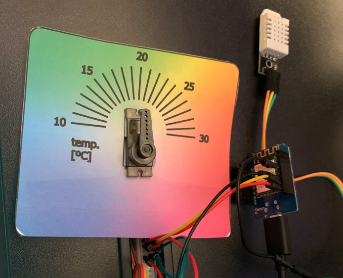
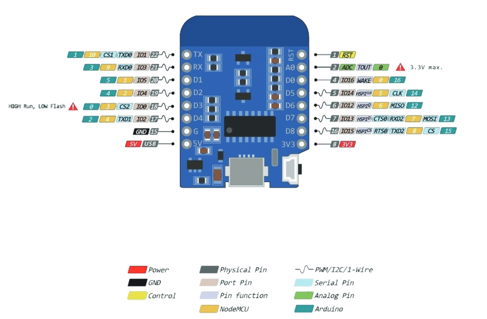
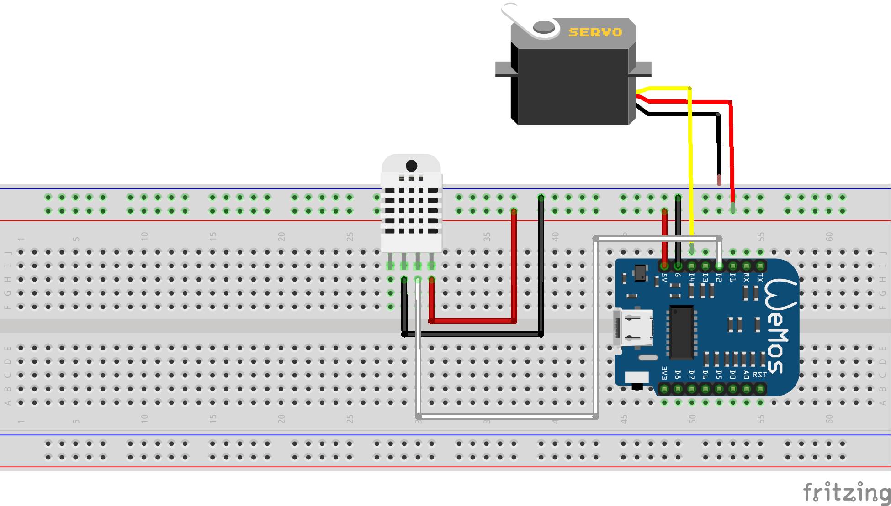

# Arduino Analog-Thermometer Project



This project involves controlling a servo motor based on temperature readings from a DHT22 sensor. The servo position changes depending on the temperature, simulating a ventilation control system.

## Table of Contents
- [Arduino Analog-Thermometer Project](#arduino-analog-thermometer-project)
  - [Table of Contents](#table-of-contents)
  - [Project Task](#project-task)
  - [Required Components](#required-components)
  - [Components Wiring](#components-wiring)
    - [Pinout ESP8266 D1 Mini NodeMcu](#pinout-esp8266-d1-mini-nodemcu)
    - [Circuit diagram](#circuit-diagram)
  - [Programming](#programming)
    - [Arduino Language Overview](#arduino-language-overview)
    - [Core Arduino Functions](#core-arduino-functions)
    - [Required Libraries](#required-libraries)

## Project Task
Create an Arduino project that continuously measures temperature using a DHT22 sensor and adjusts a servo motor's position based on the temperature. This project simulates a temperature-dependent ventilation system.

**Specifications**:

1. Measure the temperature every few seconds.
2. When the temperature changes, move the servo motor to a position that corresponds to the new temperature within the range of 15°C to 25°C.
3. Set the servo to move toward 180° at lower temperatures and 0° at higher temperatures, adjusting smoothly within the specified range.


## Required Components
To complete this project, you will need the following components:

- 1x ESP8266 D1 Mini NodeMcu
- 1x DHT22 temperature and humidity sensor
- 1x Servo motor (range minimum 0&deg; to 180&deg;)
- 1x [Thermometer scale paper]() 
- Jumper wires
- Breadboard

## Components Wiring
This pinout diagram is necessary for defining pins and wiring the components according to the following circuit diagram. Complete the wiring as shown in the circuit schematic.

### Pinout ESP8266 D1 Mini NodeMcu


### Circuit diagram


## Programming

### Arduino Language Overview
The Arduino programming environment is based on C++ and uses basic data types and syntax similar to C++. Key elements include:

- **Data Types**:
  - `int` for integers: `int variable = 10;`
  - `float` for floating-point numbers: `float temperature = 23.5;`
  - `bool` for boolean values: `bool status = true;`

- **Syntax**: 
  - Statements end with a semicolon `;`.
  - Control structures like `if`, `for`, and `while` are structured similarly to C++.

### Core Arduino Functions

Some of the most essential functions and structures for Arduino programs include:

1. **Pin Definition**:
   - Pins are defined as `INPUT` or `OUTPUT` using `pinMode()`.
   - Example: `pinMode(13, OUTPUT);`

2. **Voltage Setting and Digital Output**:
   - `digitalWrite()` sets a pin to HIGH or LOW.
   - Example: `digitalWrite(13, HIGH);`

3. **Analog Reading**:
   - `analogRead()` reads the value from an analog pin.
   - Example: `int value = analogRead(A0);`

4. **Serial Output**:
   - `Serial.begin()` initializes serial communication.
   - `Serial.print()` and `Serial.println()` are used to output text and values to the serial monitor.
   - Example:
     ```cpp
     Serial.begin(9600);
     Serial.println("Measurement: ");
     ```

### Required Libraries

1. **Servo.h**
   - Enables control of a servo motor.
   - Example for initialization and use:
     ```cpp
     #include <Servo.h>
     Servo myServo;
     myServo.attach(9);  // Attach servo to pin 9
     myServo.write(90);  // Set servo to 90 degrees
     ```

2. **DHT.h**
   - Enables temperature and humidity measurement with a DHT sensor (e.g., DHT22).
   - Take care this sensor is really slow it needs at least one second to rest for every measurement to be accurate.
      ```cpp
     delay(1000);
     ```
   - Example for initialization and use:
     ```cpp
     #include <DHT.h>
     DHT dht(D2, DHT22);  // Use D2 pin and DHT22 sensor type
     float temperature = dht.readTemperature();
     ```

Happy coding, and enjoy building your temperature-controlled servo project!
