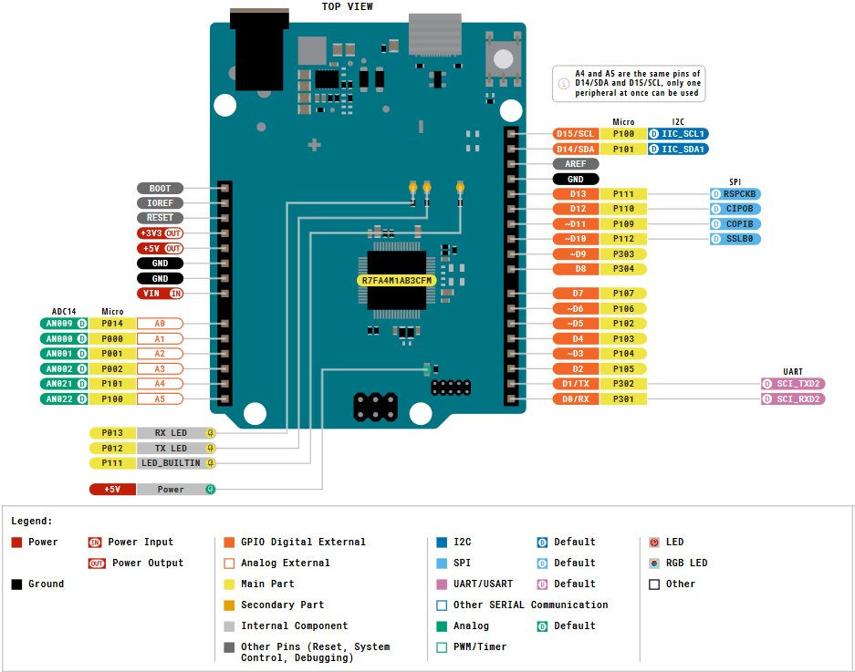

# Persistent-Credentials MicroSD Project


<!-- 
 -->

This project involves creating a system for securely storing and updating Wi-Fi credentials on an SD card using an Arduino Uno R4 Minima and an OLED display. It reads and writes credentials on the SD card, displays the current credentials on the OLED, and allows users to update them via serial input. The beauty of data persistense shows up after switching the power off and back on, your credentials should still be there.

## Table of Contents
- [Persistent-Credentials MicroSD Project](#persistent-credentials-microsd-project)
  - [Table of Contents](#table-of-contents)
  - [Project Task](#project-task)
  - [Required Components](#required-components)
  - [Components Wiring](#components-wiring)
    - [Pinout Arduino Uno R4 Minima](#pinout-arduino-uno-r4-minima)
    - [Circuit Diagram](#circuit-diagram)
  - [Programming](#programming)
    - [Arduino Language Overview](#arduino-language-overview)
    - [Arduino Serial Monitor](#arduino-serial-monitor)
    - [Required Libraries](#required-libraries)

## Project Task
Develop an Arduino project that saves Wi-Fi credentials (SSID and password) to an SD card, retrieves these credentials for display on an OLED screen, and allows users to update them via the serial monitor.

**Specifications**:
1. Store SSID and password on the SD card.
2. Display the current SSID and password on an OLED screen.
3. Prompt the user to update SSID and password via the serial monitor.
4. Save any changes to the SD card and update the OLED display.

## Required Components
To complete this project, you will need the following components:

- 1x ESP8266 D1 Mini NodeMcu
- 1x MicroSD card module
- 1x OLED display (128x64 resolution)
- Jumper wires
- Breadboard

## Components Wiring
Refer to the pinout diagram and follow the wiring instructions to connect the components according to the circuit schematic.

### Pinout Arduino Uno R4 Minima


### Circuit Diagram


## Programming

### Arduino Language Overview
The Arduino programming environment is based on C++ and uses basic data types and syntax similar to C++. Key elements include:

- **Data Types**:
  - `int` for integers: `int variable = 10;`
  - `float` for floating-point numbers: `float temperature = 23.5;`
  - `bool` for boolean values: `bool status = true;`

- **Syntax**: 
  - Statements end with a semicolon `;`.
  - Control structures like `if`, `for`, and `while` are structured similarly to C++.

### Arduino Serial Monitor
In this project, you’ll use the serial monitor to receive inputs for updating the SSID and password.

1. **Wait for Input**:
     - `Serial.available()` checks on the Serial Monitor if data from the user is available.
     - Example:
       ```cpp
       if (Serial.available() > 0) {
           // Some new Input was detected now we have to read it
       }
       ```

2. **Read Input**:
     - `Serial.readStringUntil('\n')` reads input from the serial monitor until a newline character.
     - Example:
       ```cpp
       String userInput = Serial.readStringUntil('\n');
       userInput.trim();  // Removes extra spaces or newline characters
       ```

3. **Serial Output / Prompt for Input**:
   - `Serial.begin()` initializes serial communication.
   - `Serial.print()` and `Serial.println()` are used to output text and values to the serial monitor.
   - Example:
     ```cpp
     Serial.begin(9600); // Needs to be done once in void setup() 
     Serial.println("Enter new SSID:");
     ```

### Required Libraries

1. **SdFat.h**
   - Provides support for reading and writing to an SD card.
   - Examples for opening, reading, writing, and truncating files:
     ```cpp
     #include <SPI.h>
     #include <SdFat.h>
     SdFat sdcard;

     // Initialize the SD card
     if (!sdcard.begin(10, SD_SCK_MHZ(4))) {
         Serial.println("SD card initialization failed.");
     }

     // Open a file to read
     FsFile file = sdcard.open("file.txt", FILE_READ);
     if (file) {
         String content = file.readString();
         file.close();
     }

     // Write data to a file
     FsFile writeFile = sdcard.open("file.txt", FILE_WRITE);
     if (writeFile) {
         writeFile.println("Hello, SD card!");
         writeFile.close();
     }

     // Truncate (overwrite) a file
     FsFile truncateFile = sdcard.open("file.txt", FILE_WRITE | O_TRUNC);
     if (truncateFile) {
         truncateFile.println("New content overwrites old data.");
         truncateFile.close();
     }
     ```

2. **Adafruit_SSD1306.h** and **Adafruit_GFX.h**
   - Supports displaying text and graphics on an OLED screen.
   - Examples for clearing and writing on the display:
     ```cpp
     #include <Adafruit_GFX.h>
     #include <Adafruit_SSD1306.h>
     
     Adafruit_SSD1306 display(128, 64, &Wire, -1);

     // Initialize the display
     if (!display.begin(SSD1306_SWITCHCAPVCC, 0x3C)) {
         Serial.println("OLED initialization failed.");
     }

     // Clear the display
     display.clearDisplay();
     display.display();

     // Write text on the display
     display.setTextColor(WHITE);
     display.setTextSize(1);
     display.setCursor(0, 0);
     display.print("SSID:");
     display.setCursor(0, 10);
     display.print("Password:");
     display.display();
     ```

3. **ArduinoJson.h**
   - Provides JSON parsing and serialization support for saving and loading Wi-Fi credentials.
   - Example for serialization and deserialization:
     ```cpp
     #include <ArduinoJson.h>
     StaticJsonDocument<200> configData;
     configData["ssid"] = "YourSSID";
     configData["password"] = "YourPassword";
     serializeJson(configData, Serial);  // Outputs JSON to serial monitor
     ```

Happy coding, and enjoy building your persistent credentials storage project on MicroSD!
