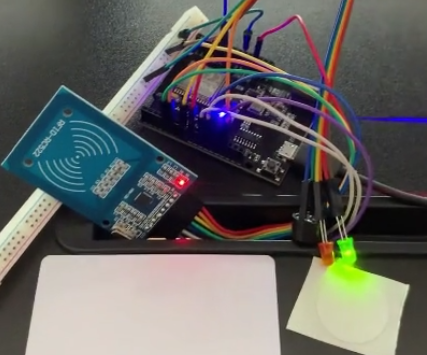
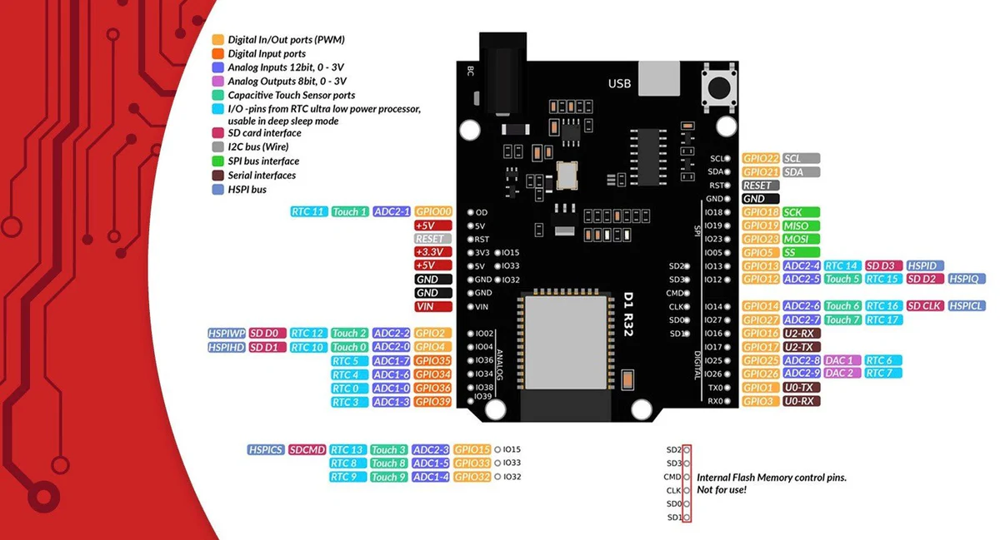
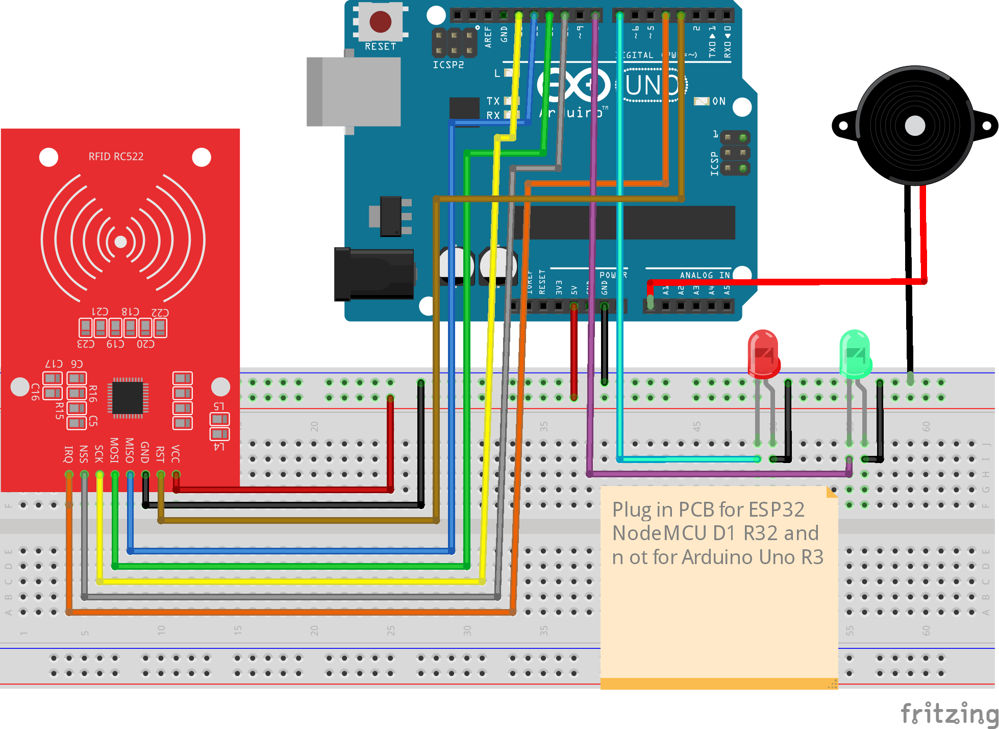

# Arduino RFID Door Opener System

<!--  -->


This project involves using an RFID reader and an ESP32 NodeMCU D1 R32 to control access based on the UID of an RFID card. When a recognized card is scanned, a green LED lights up, and an access granted message is shown; for unrecognized cards, a red LED lights up, and access is denied. A buzzer gives audio feedback for both cases.

## Table of Contents
- [Arduino RFID Door Opener System](#arduino-rfid-door-opener-system)
  - [Table of Contents](#table-of-contents)
  - [Project Task](#project-task)
  - [Required Components](#required-components)
  - [Components Wiring](#components-wiring)
    - [Pinout ESP32 NodeMCU D1 R32](#pinout-esp32-nodemcu-d1-r32)
    - [Circuit Diagram](#circuit-diagram)
  - [Programming](#programming)
    - [PlatformIO Config](#platformio-config)
    - [Arduino Language Overview](#arduino-language-overview)
    - [Core Arduino Functions](#core-arduino-functions)
    - [Required Libraries](#required-libraries)

## Project Task
Create an Arduino project that reads the UID of an RFID card using an MFRC522 RFID module. If the UID matches a predefined value, the green LED lights up, access is granted, and a confirmation tone sounds. If the UID does not match, the red LED lights up, access is denied, and an error tone sounds.

**Specifications**:
1. Continuously scan for RFID cards.
2. If the scanned card UID matches the predefined UID, light the green LED, play a confirmation tone, and display an access granted message on the serial monitor.
3. If the UID does not match, light the red LED, play an error tone, and display an access denied message on the serial monitor.

## Required Components
To complete this project, you will need the following components:

- 1x ESP32 NodeMCU D1 R32
- 1x MFRC522 RFID module
- NFC chips (card, key fob, sticker)
- 1x Green LED
- 1x Red LED
- 1x Buzzer
- Jumper wires
- Breadboard

## Components Wiring
Refer to the pinout diagram and follow the wiring instructions to connect the components according to the circuit schematic.

### Pinout ESP32 NodeMCU D1 R32


### Circuit Diagram


## Programming

### PlatformIO Config
Platform = espressif32
Board = wemos_d1_uno32
Framework = arduino

### Arduino Language Overview
The Arduino programming environment is based on C++ and uses basic data types and syntax similar to C++. Key elements include:

- **Data Types**:
  - `int` for integers: `int variable = 10;`
  - `float` for floating-point numbers: `float temperature = 23.5;`
  - `bool` for boolean values: `bool status = true;`

- **Syntax**: 
  - Statements end with a semicolon `;`.
  - Control structures like `if`, `for`, and `while` are structured similarly to C++.

### Core Arduino Functions

Some of the most essential functions and structures for Arduino programs include:

1. **Pin Definition**:
   - Pins are defined as `INPUT` or `OUTPUT` using `pinMode()`.
   - Example: `pinMode(13, OUTPUT);`
     ```cpp
     // Define a pinMode
     #define LED_GREEN 12
     
     pinMode(LED_GREEN, OUTPUT);
     ```

2. **Voltage Setting and Digital Output**:
   - `digitalWrite()` sets a pin to HIGH or LOW.
   - Example: `digitalWrite(13, HIGH);`
     ```cpp
     // Blink an LED for 1 sec
     digitalWrite(LED_GREEN, HIGH);
     delay(1000);
     digitalWrite(LED_GREEN, LOW);
     ```

3. **Serial Output**:
   - `Serial.begin()` initializes serial communication.
   - `Serial.print()` and `Serial.println()` are used to output text and values to the serial monitor.
   - Example:
     ```cpp
     Serial.begin(9600);
     Serial.println("Measurement: ");
     ```

### Required Libraries

1. **MFRC522.h**
   - Provides support for RFID scanning and UID retrieval with the MFRC522 module.
   - Example for initialization and reading UID:
     ```cpp
     #include <SPI.h>
     #include <MFRC522.h>
     MFRC522 mfrc522(SS_PIN, RST_PIN);  // RFID module pin definitions

     // Initialize the RFID reader
     mfrc522.PCD_Init();

     // Check for a new card
     if (mfrc522.PICC_IsNewCardPresent() && mfrc522.PICC_ReadCardSerial()) {
         String cardUID = "";
         for (byte i = 0; i < mfrc522.uid.size; i++) {
             cardUID.concat(String(mfrc522.uid.uidByte[i] < 0x10 ? " 0" : " "));
             cardUID.concat(String(mfrc522.uid.uidByte[i], HEX));
         }
         Serial.println("Card UID: " + cardUID);
     }
     ```

2. **Controlling Buzzer**:
   - Use `tone()` to control the buzzer. Outputting a specific frequency requires a PWM pin.
   - Example for buzzer control:
     ```cpp
     // The Buzzer pin has to be defined as Output first

     // Play a confirmation tone
     tone(BUZZER_PIN, 800, 1000);  // 800 Hz for 1 second
     ```

Happy coding, and enjoy building your RFID access control project!
