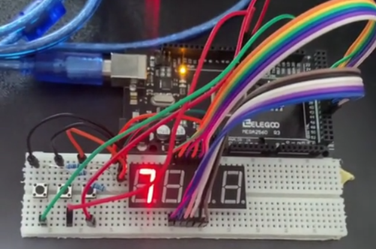
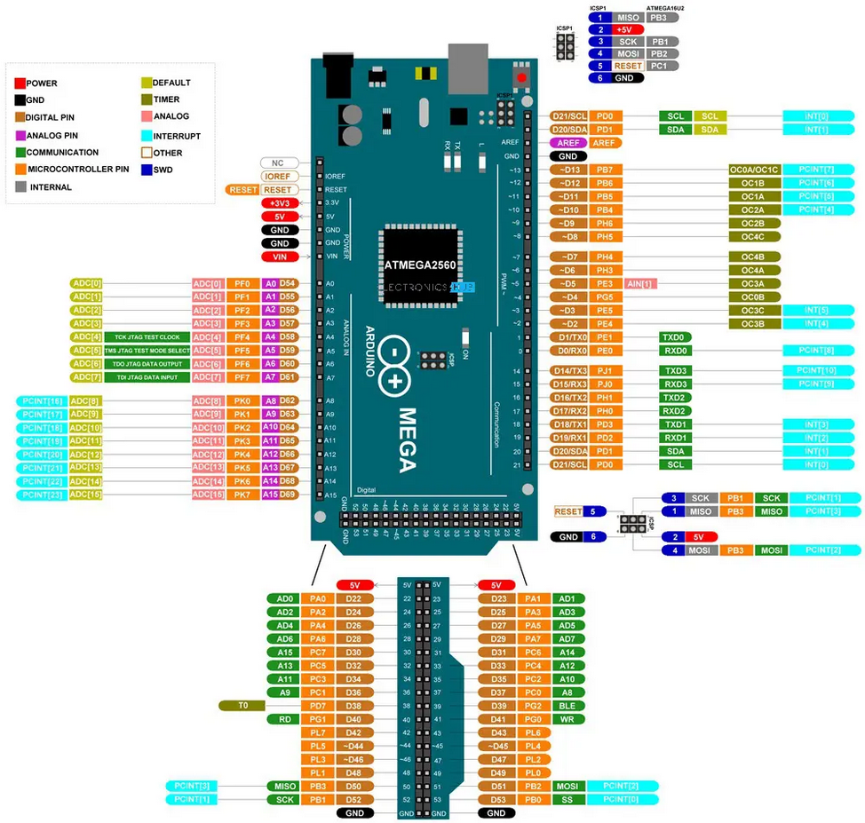
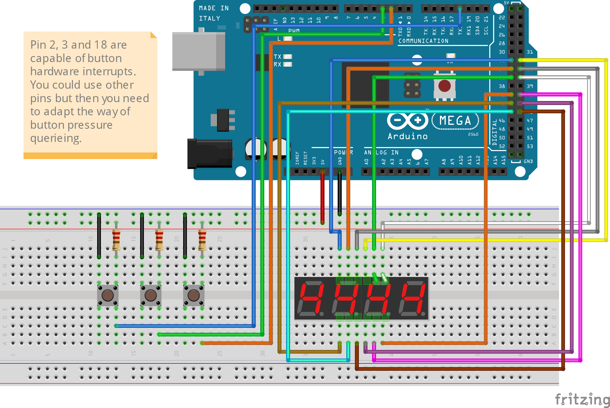

# Arduino Timer Start-Stop-Reset Project

<!--  -->


This project involves creating a digital timer with start, stop, and reset functionality, controlled by physical buttons. The timer counts seconds and displays the value on a 4-digit 7-segment display. When the start button is pressed, the timer begins counting up; when the stop button is pressed, the timer stops; and pressing the reset button resets the timer to zero.

## Table of Contents
- [Arduino Timer Start-Stop-Reset Project](#arduino-timer-start-stop-reset-project)
  - [Table of Contents](#table-of-contents)
  - [Project Task](#project-task)
  - [Required Components](#required-components)
  - [Components Wiring](#components-wiring)
    - [Pinout Arduino Mega 2560 (Rev3)](#pinout-arduino-mega-2560-rev3)
    - [Circuit Diagram](#circuit-diagram)
  - [Programming](#programming)
    - [PlatformIO Config](#platformio-config)
    - [Arduino Language Overview](#arduino-language-overview)
    - [Core Arduino Functions](#core-arduino-functions)
    - [Required Libraries](#required-libraries)

## Project Task
Create an Arduino-based timer with start, stop, and reset functions, displayed on a 7-segment display. The timer can be controlled by three buttons: one to start, one to stop, and one to reset the timer.

**Specifications**:
1. Start the timer when the start button is pressed.
2. Stop the timer when the stop button is pressed.
3. Reset the timer to zero when the reset button is pressed.
4. Display the timer's current value on a 4-digit 7-segment display.

## Required Components
To complete this project, you will need the following components:

- 1x Arduino Mega 2560 (Rev3)
- 1x 4-digit 7-segment display
- 3x 10k Ohm resistors
- 3x Buttons
- Jumper wires (Lots of!)
- Breadboard

## Components Wiring
Refer to the pinout diagram and follow the wiring instructions to connect the components according to the circuit schematic.

### Pinout Arduino Mega 2560 (Rev3)


### Circuit Diagram


## Programming

### PlatformIO Config
- Platform = atmelavr
- Board = megaatmega2560
- Framework = arduino

### Arduino Language Overview
The Arduino programming environment is based on C++ and uses basic data types and syntax similar to C++. Key elements include:

- **Data Types**:
  - `int` for integers: `int variable = 10;`
  - `float` for floating-point numbers: `float temperature = 23.5;`
  - `bool` for boolean values: `bool status = true;`

- **Syntax**: 
  - Statements end with a semicolon `;`.
  - Control structures like `if`, `for`, and `while` are structured similarly to C++.

- **Volatiles**
  - In this project, certain variables could be declared as `volatile` to ensure they are correctly updated in interrupt routines. The `volatile` keyword tells the compiler not to optimize these variables, as their values may change outside the main program flow, such as in an interrupt.
  - `volatile bool timerRunning = false;`


### Core Arduino Functions

Some of the most essential functions and structures for Arduino programs include:

1. **Pin Definition**:
   - Pins are defined as `INPUT` or `OUTPUT` using `pinMode()`.
   - Example: `pinMode(13, OUTPUT);`

2. **Voltage Setting and Digital Output**:
   - `digitalWrite()` sets a pin to HIGH or LOW.
   - Example: `digitalWrite(13, HIGH);`

3. **Serial Output**:
   - `Serial.begin()` initializes serial communication.
   - `Serial.print()` and `Serial.println()` are used to output text and values to the serial monitor.
   - Example:
     ```cpp
     Serial.begin(9600);
     Serial.println("Measurement: ");
     ```
4. **Working with Buttons:**

   - **Button Debouncing** (optional)
      - Button debouncing ensures that button presses are registered accurately and prevents multiple readings from a single press.
      - Example for debouncing:
        ```cpp
        volatile unsigned long lastButtonPress = 0;
        const unsigned long debounceDelay = 200;

        bool debounce(volatile unsigned long &lastPressTime) {
            unsigned long currentTime = millis();
            if (currentTime - lastPressTime >= debounceDelay) {
                lastPressTime = currentTime;
                return true;
            }
            return false;
        }
        ```

   - **Using Interrupts for Button Control** (advanced)
      - Setting up button interrupts to respond to start, stop, and reset events.
      - Example for setting up an interrupt for a button:
        ```cpp
        pinMode(StartButtonPin, INPUT);
        attachInterrupt(digitalPinToInterrupt(StartButtonPin), startButtonReleased, FALLING);
        ```
   - **Manually checking if Button is pressed** (easy)
      - Detect button pressure by asking for Input with `digitalRead()`.
        ```cpp
        if (digitalRead(StartButtonPin) == LOW && debounce(lastStartPress)) {
           Serial.println("Start button pressed!");
           timerRunning = true;
        }

        // You don't need to use the debounce

        if (digitalRead(StartButtonPin) == LOW) {
           Serial.println("Start button pressed!");
           timerRunning = true;
        }
        ```   

### Required Libraries

1. **SevSeg.h**
   - This library supports controlling a 4-digit 7-segment display to show the timer value.
   - Examples for initializing the display, writing values, and refreshing:
     ```cpp
     #include <SevSeg.h>
     SevSeg sevseg;

     const uint8_t numDigits = 4;  
     const bool resistorsOnSegments = 0; 
     const uint8_t segmentPins[] = {34, 37, 43, 44, 42, 35, 41, 45};
     const uint8_t digitPins[] = {32, 33, 36, 40};

     // Initialize the display
     sevseg.begin(COMMON_ANODE, numDigits, digitPins, segmentPins, resistorsOnSegments);
     sevseg.setBrightness(60);

     // Display a number
     char buffer[10];
     itoa(1234, buffer, 10);
     sevseg.setChars(buffer);
     sevseg.refreshDisplay();
     ```

Happy coding, and enjoy building your timer project with start, stop, and reset functionality!
