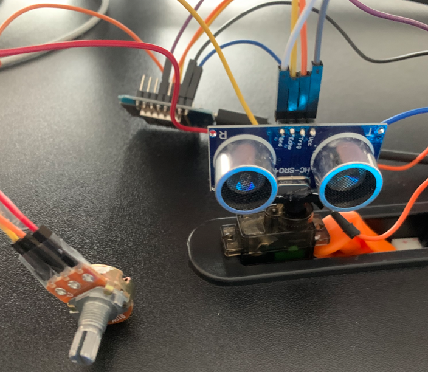
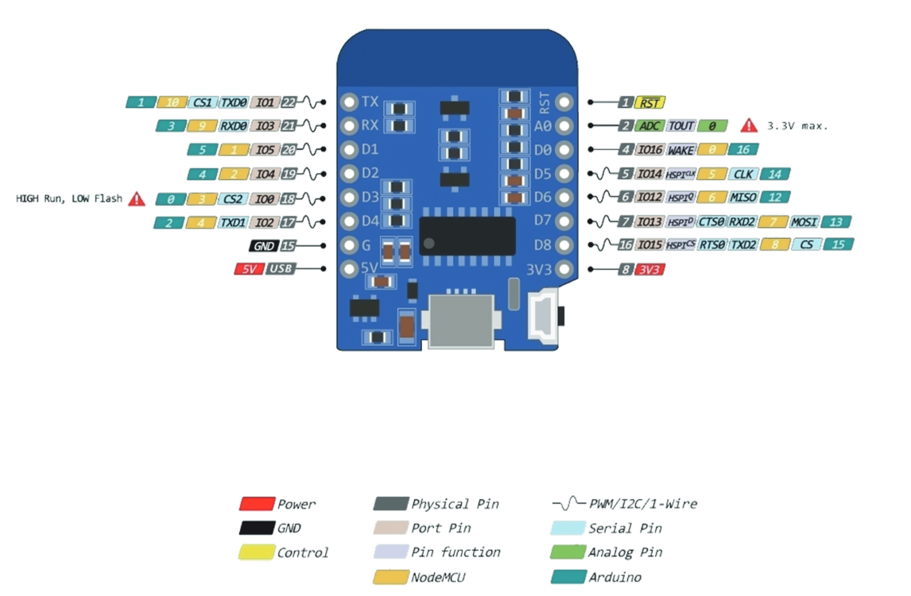
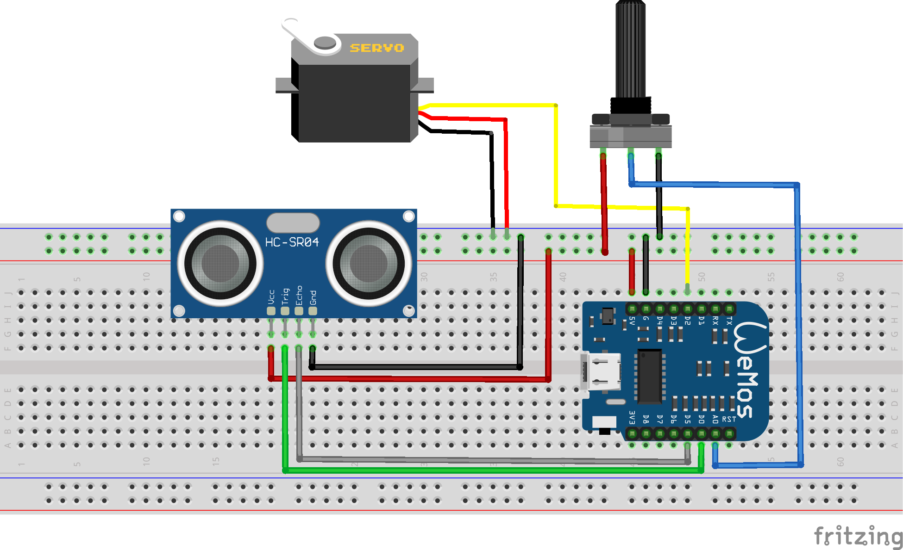

# Arduino Ultrasonic Radar Tower Project

<!--  -->


This project uses an ultrasonic sensor mounted on a servo motor to measure distances in a specific direction, simulating a radar-like function. The servo angle can be controlled by a potentiometer, allowing the sensor to sweep and display distances in real-time.

## Table of Contents
- [Arduino Ultrasonic Radar Tower Project](#arduino-ultrasonic-radar-tower-project)
  - [Table of Contents](#table-of-contents)
  - [Project Task](#project-task)
  - [Required Components](#required-components)
  - [Components Wiring](#components-wiring)
    - [Pinout ESP8266 D1 Mini NodeMcu](#pinout-esp8266-d1-mini-nodemcu)
    - [Circuit Diagram](#circuit-diagram)
  - [Programming](#programming)
    - [Arduino Language Overview](#arduino-language-overview)
    - [Core Arduino Functions](#core-arduino-functions)
    - [Required Libraries](#required-libraries)

## Project Task
Create an Arduino-based radar system that controls the angle of an ultrasonic sensor using a potentiometer and measures the distance to objects in front of the sensor. The servo position changes according to the potentiometer value, while the ultrasonic sensor continuously measures distance.

**Specifications**:
1. Control the angle of the ultrasonic sensor using a potentiometer.
2. Measure the distance to objects in front of the ultrasonic sensor.
3. Display the angle and measured distance on the serial monitor.

## Required Components
To complete this project, you will need the following components:

- 1x ESP8266 D1 Mini NodeMcu
- 1x Ultrasonic sensor (HC-SR04)
- 1x Servo motor
- 1x Potentiometer
- Jumper wires
- Breadboard

## Components Wiring
Refer to the pinout diagram and follow the wiring instructions to connect the components according to the circuit schematic.

### Pinout ESP8266 D1 Mini NodeMcu


### Circuit Diagram


## Programming

### Arduino Language Overview
The Arduino programming environment is based on C++ and uses basic data types and syntax similar to C++. Key elements include:

- **Data Types**:
  - `int` for integers: `int variable = 10;`
  - `float` for floating-point numbers: `float temperature = 23.5;`
  - `bool` for boolean values: `bool status = true;`

- **Syntax**: 
  - Statements end with a semicolon `;`.
  - Control structures like `if`, `for`, and `while` are structured similarly to C++.

### Core Arduino Functions

Some of the most essential functions and structures for Arduino programs include:

1. **Pin Definition**:
   - Pins are defined as `INPUT` or `OUTPUT` using `pinMode()`.
   - Example: `pinMode(13, OUTPUT);`

2. **Voltage Setting and Digital Output**:
   - `digitalWrite()` sets a pin to HIGH or LOW.
   - Example: `digitalWrite(13, HIGH);`

3. **Analog Reading**:
   - `analogRead()` reads the value from an analog pin.
   - Example: `int value = analogRead(A0);`

4. **Serial Output**:
   - `Serial.begin()` initializes serial communication.
   - `Serial.print()` and `Serial.println()` are used to output text and values to the serial monitor.
   - Example:
     ```cpp
     Serial.begin(9600);
     Serial.println("Measurement: ");
     ```

### Required Libraries

1. **Servo.h**
   - This library controls a servo motor to adjust the angle of the ultrasonic sensor.
   - Example for initialization and usage:
     ```cpp
     #include <Servo.h>
     Servo myServo;
     
     // Attach the servo to pin 9
     myServo.attach(9);
           
     // Servo movements possible from 0-180 degrees
     myServo.write(90);
     ```

2. **Ultrasonic Sensor Measurement**
   - To measure distance using an ultrasonic sensor, you send a pulse from the trigger pin and then measure the duration of the echo pulse.
   - Example of sending a pulse and measuring distance:
     ```cpp
     #define TRIG_PIN 7
     #define ECHO_PIN 8
     
     void sendSoundPulse() {
       digitalWrite(TRIG_PIN, LOW);
       delayMicroseconds(2);
       digitalWrite(TRIG_PIN, HIGH);
       delayMicroseconds(10);
       digitalWrite(TRIG_PIN, LOW);
     }

     long measureDistance() {
       sendSoundPulse();
       long duration = pulseIn(ECHO_PIN, HIGH);
       float distance = (duration * 0.0343) / 2.0;  
       // Speed of sound in cm/µs
       
       return distance;
     }
     ```

3. **Using a Potentiometer to Control Servo Position**
   - The potentiometer provides analog input to control the servo’s angle.
   - Example of reading the potentiometer and mapping its value to an angle:
     ```cpp
     int potValue = analogRead(A0);
     // potValue will be a value from 0 to 1023
     ```

Happy coding, and enjoy building your ultrasonic radar tower project!